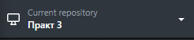

# Практична 3
**Використання Markdown та його оформлення.Способи документації проєкту**
## Встановлення
```bash
git clone [https://github.com/extchik/pract-2.git](https://github.com/extchik/pract-2.git)
```
## Використання

**Для перегляду та запуску проєкту відкрийте файл `index.html`**

```bash
npx serve .
```
## Основний синтаксис Markdown

| Елемент | Синтаксис | Приклад |
| :--- | :--- | :--- |
| **Заголовок** | `# Текст` / `## Текст` | # H1, ## H2 |
| **Стиль** | `**жирний**` / `*курсив*` | **жирний** / *курсив* |
| **Список** | `- Елемент` або `1. Елемент` | • Пункт / 1. Пункт |
| **Посилання** | `[Текст](URL)` | [GitHub](https://github.com) |
| **Код** | `` `команда` `` | `git status` |
| **Цитата** | `> Текст` | > Примітка |
### Прев'ю репозиторію
